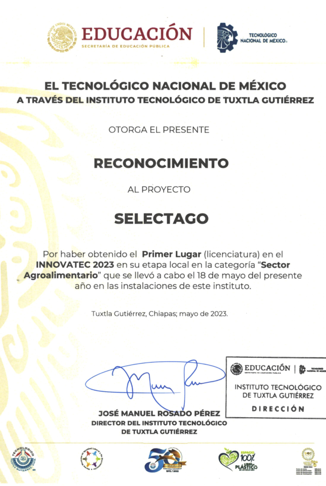

# 📱 SelectagoApp

### Aplicación para la reducción de mermas frutícolas y gestión de recursos agrarios mediante IA

## 📖 Descripción  
SelectagoApp es una aplicación móvil diseñada para ayudar a los agricultores a reducir pérdidas en la cosecha mediante la identificación y clasificación de frutas utilizando un modelo de inteligencia artificial. 
La aplicación permite escanear frutas como mango, rambután y limón para evaluar su calidad y gestionar eficientemente los recursos agrarios.  

  

---

## ✨ Características  
✔️ **Clasificación de frutas con IA** mediante visión por computadora.  
✔️ **Gestión de recursos agrarios** con registro de lotes y predicción de calidad.  
✔️ **Interfaz intuitiva** diseñada para facilitar su uso en campo.  
✔️ **Monetización integrada** con Google AdMob.  

---

## 🛠️ Tecnologías Utilizadas  
| Categoría                        | Tecnologías/Versiones                                          |
|----------------------------------|----------------------------------------------------------------|
| IDE de desarrollo                | Android Studio                                                 |
| Lenguajes de programación        | Kotlin 1.8, Java 8                                             |
| Modelo de IA en la app           | TensorFlow Lite 2.9                                            |
| Base de datos local              | SQLite 3.32.2                                                  |
| Monetización                     | Google AdMob 22.2.0                                            |
| Entrenamiento del modelo IA      | Python 3.10, TensorFlow 2.13, Roboflow   

## 🏅 Reconocimiento
El proyecto fue presentado en la competencia de innovación tecnológica INNOVATEC 2023 en el Instituo Tecnológico de Tuxtla Gutiérrez, consiguiendo el primer lugar en la categoría agroalimentaria durante la fase local.
 

  

### Procedimiento
1. Descarga el archivo `.apk` del siguiente enlance :
[selectagoapp-v1.0.apk](https://github.com/EonOohx/selectago-app/releases/download/v1.0.0/selectagoapp-release.apk)
3. Ábrelo en tu dispositivo Android y acepta los permisos de instalación de fuentes externas
4. ¡Listo!

## 📬 Contacto

Si deseas dejar comentarios, sugerencias o contactarme:

📧 Correo: [RaulAlejandro_RodriguezR@hotmail.com]
